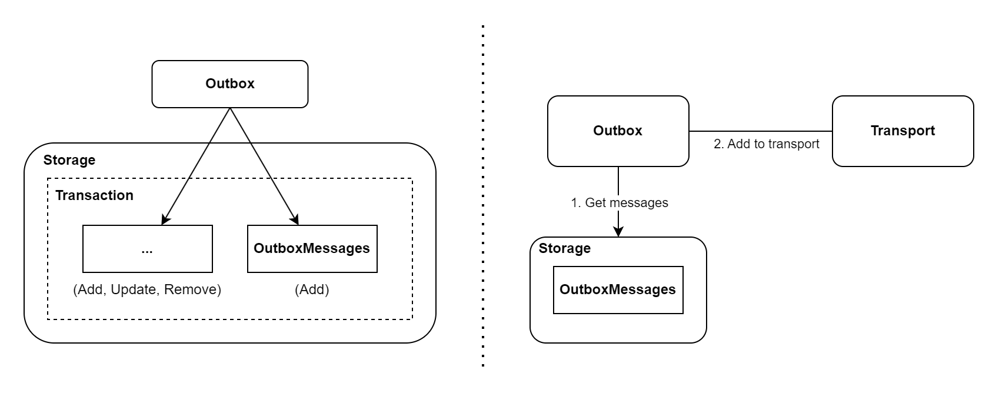

    

<h3 align="center">Outbox and Inbox pattern in .NET</h3>

  

    <i>Ensures reliable network communication (eventual consistency) between services.</i>
     
     
    <a href="https://transactionalbox.com/"><strong>Documentation</strong></a>
    |
    <a href="https://www.nuget.org/packages?q=TransactionalBox"><strong>Packages</strong></a>
  

    

##### :star: - The star motivates me a lot!   

### :fire: Examples of network communication problems
-  **Lost message**

*Amount was taken from bank account and transfer was never executed.*

- **The same message was processed again**

*Transfer was ordered and amount was debited from bank account twice.*

- **Unavailable service**

*Transfer order attempt fails.*

### :star2: Benefits
- **Easy To Use**
    - *Quick learning and low entry threshold*
    - *Configured by default to prevent overwhelm for beginners*
    - *Add message to outbox and then appears in inbox handler*
- **Eventual Consistency**
    - *Outbox sends a message at least once*
    - *Inbox deduplicates the message and processes exactly once*
- **Scalability & Fault Tolerance**
    - *Retry pattern with delay*
    - *Multiple instances of the same service (distributed processing)*
- **Highly Configurable & Extendable**
    - *Components are configurable via settings*
    - *Extendable with new transport and storage providers*
- **Reduce Latency & Increase Bandwidth**
    - *Hook processing (instead of interval processing)*
    - *Compression algorithms*
    - *Grouping messages by type to transport message (better compression)*
    - *Adjusting optimal transport message size*

## :clapper: Run Demo & Sample

<h3 align="center">
<a href="https://www.youtube.com/watch?v=EXPRs9cnCnw&ab_channel=DJTV98"><strong>:clapper: DEMO on YouTube :clapper:</strong></a>
</h3>

> [!NOTE]
> Docker is required.

Clone this repo and open `TransactionalBox.sln` via Visual Studio 2022. Set the `TransactionalBox.Sample.WebApi` as startup and then run. You should see the following view.

    

*Project is at an early stage of life cycle, if you find some bug, let me know* :telephone:.   

Have fun :smiley:!

## :european_castle: Architecture
The transactional box consists of two basic components.
The following diagrams show the basic flow (omits details).
They are designed to provide a general understanding of how transactional box works.

### Outbox
The outbox is responsible for adding messages to the storage and then adding at least once to the transport.

    

### Inbox 
The inbox is responsible for getting messages from the transport and adding them to the storage, and then processes these messages.

    

## :world_map: Roadmap
Name of **TransactionalBox** fits perfectly with the future of the project. It will be possible to use different `transactional boxes`. 

### Outbox and Inbox

`No guarantee of message order between services.`

Implementation under the competition.

*e.g. Payment service asynchronously sends notification of payment to user.*

Improvements:
- Code refactor
- More tests
- Support for more storage providers (e.g. MongoDB, Marten)
- Support for more transport providers (e.g. Iggy, RabbitMq, HTTP, gRPC)
- Performance optimization

### StreamOubox and StreamInbox

`Guarantee of message order in stream between services.`

**Idea**  
Ensuring the order of messages within a stream. Messages are sent by StreamOutbox and the order is respected in StreamInbox. Transport provider does not have to support message order.

*e.g. (CQRS Pattern) When transfer is made in the write service, the event asynchronously refreshes the account balance in the read service.*

### InternalBox

`Guarantee of message order in stream inside the service.`

**Idea**   
Ensuring the order of messages within a stream insite the service. Messages are added to storage provider and then processed. Transport provider is unnecessary.

*e.g. Asynchronous internal communication between Aggregate Roots using domain events in the same service.*

## :medal_sports: Competition 100commitow
The project is part of the competition [100 commitow](https://100commitow.pl).

### Topics
- Distributed lock (prevent race condition)
- Hook processing
- Concurrency control
- Scaling and parallel processing (distributed processing)
- Synchronization primitives
- Idepotent messages (message deduplication)
- Retry Pattern

## ✨ Features
#### Actions
- [x] Add a message to send to the outbox
- [x] Add a message to publish to the outbox
- [x] Get messages from outbox and add them to transport
- [x] Get a message from transport and add them to the inbox
- [x] Get a message from inbox and process it

#### Storage
- [x] InMemory (Default)
- [x] Entity Framework (Relational)
    - [x] Migrations
    - [X] Distributed Lock (Based on atomic write operation, Standalone Package)

#### Transport
- [x] InMemory (Default)
- [x] Apache Kafka

#### Scalability & Fault Tolerance
- [x] Support for multiple outbox instances
- [x] Support for multiple inbox instances
- [x] Standalone inbox
- [x] Error handling in background services
- [x] Hook processing
    - [x] Outbox
    - [x] Inbox

#### Maintenecne
- [x] Remove processed messages from the outbox
- [x] Remove processed messages from the inbox
- [x] Remove expired idempotency keys
- [x] Correlation ID

#### Other
- [x] Modular package architecture
- [x] Support for TimeProvider
- [x] Unordered messages
- [X] Internal high-performance logging (Source Generators)
- [x] Execution context in Inbox
- [x] High-performance invoking of inbox message handlers from assemblies (Compiled Lambda Expressions)
- [x] Grouping of messages
    - [x] Group by topic outbox messages to a single transport message from batch (better compression)
    - [x] Adjusting optimal transport message size
- [X] Messages serialization and deserialization
    - [X] System.Text.Json (default)
- [x] Messages compression and decompression
    - [X] No compression (default)
    - [X] Brotli
    - [x] GZip
- [x] Idempotent messages
- [x] Keyed in memory lock (based on SemaphoreSlim and ConcurrentDictionary)
- [x] Hook startup (checking if there are messages to be processed after startup)

## :balance_scale: License
This project is under the [MIT License](https://github.com/adimiko/TransactionalBox/blob/main/LICENSE).

## :radioactive: Disclaimer
The project is under development and not ready for production use.
