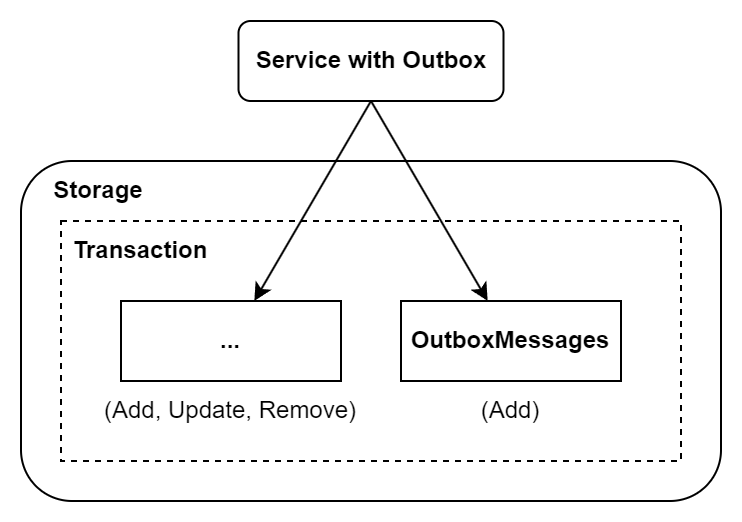
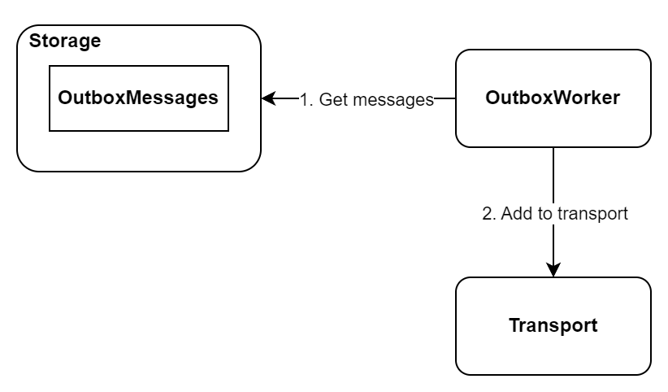
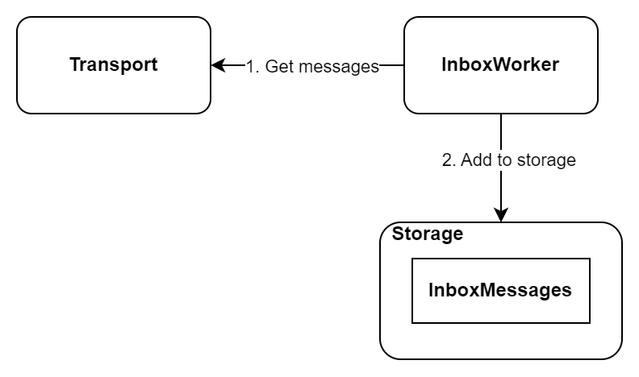
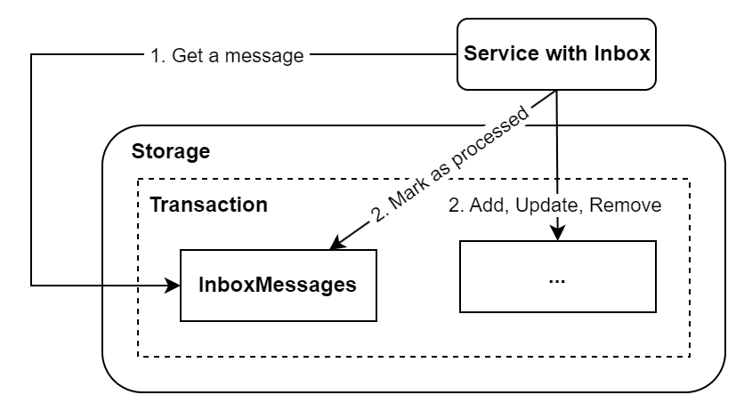

    

:star: - The star motivates me a lot!   

**Transactional box is an implementation of the outbox and inbox pattern in .NET.**   
**Ensures eventual consistency when modules need to communicate with each other over the network.**

Examples of problems that occur during network communication:
- lost messages
- the same messages were processed again
- unavailable services

## ✨ Features
#### Actions
- [x] Add a message to send to the outbox
- [ ] Add a message to publish to the outbox
- [x] Get messages from outbox and add them to transport
- [x] Get a message from transport and add them to the inbox
- [x] Get a message from inbox and process it

#### Storage
- [x] Entity Framework (Relational)
    - [x] Migrations
    - [X] Distributed Lock (Optimistic Concurency Control, Standalone Package)
- [x] InMemory
- [ ] MongoDB

#### Transport
- [x] Apache Kafka
- [x] InMemory
- [ ] RabbitMQ
- [ ] Iggy
- [ ] HTTP
- [ ] gRPC

#### Scalability & Fault Tolerance
- [ ] Support for multiple outbox worker instances
    - [ ] Multiple instances of the same service 
    - [x] Multiple processes in the same service
- [ ] Support for multiple inbox worker instances
    - [ ] Multiple instances of the same service 
    - [x] Multiple processes in the same service
- [ ] Support for multiple inbox instances
    - [ ] Multiple instances of the same service 
    - [x] Multiple processes in the same service
- [ ] Standalone outbox worker
- [ ] Standalone inbox worker
- [ ] Error handling in background services
- [ ] Dead messages

#### Observability
- [ ] Support for OpenTelemetry
- [ ] Outbox size
- [ ] Inbox size
- [ ] Message failure rate
- [ ] Message delivery latency
- [ ] Number of duplicated messages
- [ ] Message duplication rate

#### Maintenecne
- [x] Remove processed messages from the outbox
- [x] Remove processed messages from the inbox
- [ ] Remove expired idempotency keys
- [ ] Archive processed messages from the outbox
- [ ] Archive processed messages from the inbox
- [x] Correlation ID

#### Other
- [x] Modular package architecture
- [x] Support for TimeProvider
- [x] Unordered messages
- [X] Internal high-performance logging
- [x] Execution context in Inbox
- [ ] Grouping of messages
    - [x] Conversion of multiple messages from the outbox to a single transport message
    - [ ] Grouping outbox messages by topic and then by type (better compression)
- [X] Messages serialization and deserialization
    - [X] System.Text.Json (default)
    - [x] Custom (you can add your own implementation)
- [x] Messages compression and decompression
    - [X] No compression (default)
    - [X] Brotli
    - [x] GZip
    - [x] Custom (you can add your own implementation)
- [ ] Message streaming
- [ ] Package configuration using appsetings.json
- [x] Idempotent messages
- [ ] SemaphoreSlim with Key

## :clapper: Run Sample
> [!NOTE]
> Docker is required.

Clone this repo and open `TransactionalBox.sln` via Visual Studio 2022. Set the `TransactionalBox.Sample.WebApi` as startup and then run. You should see the following view.

    

Have fun :smiley:!

## :european_castle: Architecture
The transactional box consists of four basic components.
The following diagrams show the basic flow (omits details).

### Outbox
Outbox is responsible for adding messages to the storage.

    

### Outbox Worker
Outbox worker is responsible for getting the messages from storage and adding them to the transport.

    

### Inbox Worker
Inbox worker is responsible for getting messages from transport and adding them to the storage.

    

### Inbox 
Inbox is responsible for processing messages from the storage.

    

## :medal_sports: Competition '100commitow'
The project is part of the competition [100 commitow](https://100commitow.pl).

### Topics
- Distributed lock
- Concurrency control
- Scaling and parallel processing
- Synchronization primitives
- Idempotency
- Retry Pattern
- Circuit Breaker Pattern
