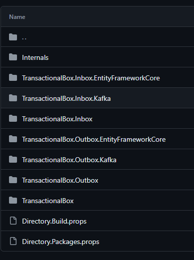

# Title
Change structure of project.

## Description
The current project architecture consists of many packages, this can be overwhelming for new users.

    

The main components `TransactionalBox.Inbox` and `TransactionalBox.Outbox` should be moved to the main package `TransactionalBox`. When using the package via extension methods, the user will decide which components to register in container. 

Packages with external dependencies are also worth merging. e.g. `TransactionalBox.Outbox.Kafka` and `TransactionalBox.Inbox.Kafka` should be moved to the `TransactionalBox.Kafka` package.

Internal packages from the `Internals` folder should be moved to the `TransactionalBox` package.

In this way we can go from 7 to 3 public packages.