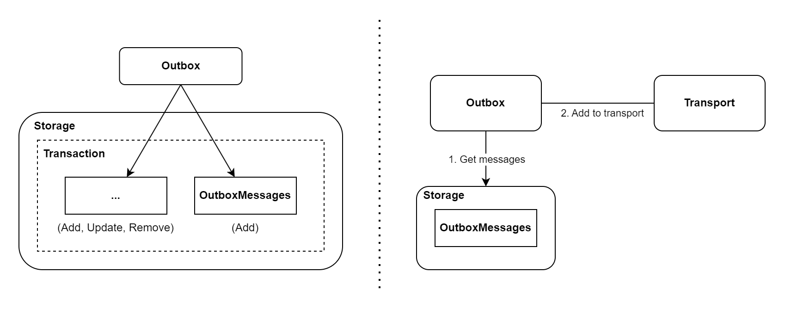
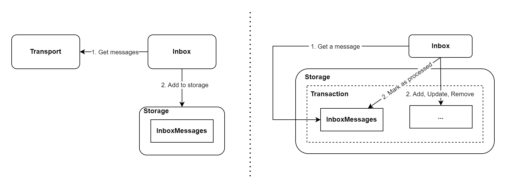

# Introduction

**Transactional box is an implementation of the outbox and inbox pattern in .NET.**   
**Ensures reliable network communication (eventual consistency) between services.**

All complexity is taken over by the transactional box and simplifies communication between services to the maximum extent possible.   
It is designed for a low entry threshold and quick learning.

Examples of problems that occur during network communication:
-  **Lost message**

*Amount was taken from bank account and transfer was never executed.*

- **The same message was processed again**

*Transfer was ordered and amount was debited from bank account twice.*

- **Unavailable service**

*Transfer order attempt fails.*

## :european_castle: Architecture
The transactional box consists of two basic components.
The following diagrams show the basic flow (omits details).
They are designed to provide a general understanding of how transactional box works.

### Outbox
The outbox is responsible for adding messages to the storage and then adding at least once to the transport.

1. In one transaction you save message to outbox and result of business operation. In this way, you can ensure all or nothing. After correctly transaction commited, execute the `TransactionCommitted` method on `IOutbox`.
2. In a separate process, Outbox will get messages and add them to the transport.
3. Then processed messages are clean up.

### Inbox 
The inbox is responsible for getting messages from the transport and adding them to the storage, and then processes these messages.

1. Inbox gets messages from transport and adds to storage.
2. In a separate process, Inbox will get messages and process them.
3. Then processed messages are clean up.

## Terms
**`OutboxMessage`** - message that is added to the outbox and then converted to `TransportMessage`.

**`TransportMessage`** - object transporting collections of messages of the same type (created on the basis of `OutboxMessages`). It is sent at least once.

**`InboxMessage`** - created on the basis of `TransportMessage` and stored in the inbox. It is then processed.

**`IdempotentInboxKey`** - incoming message identifier. It is needed for deduplication.