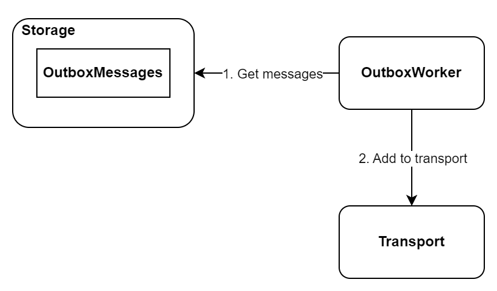
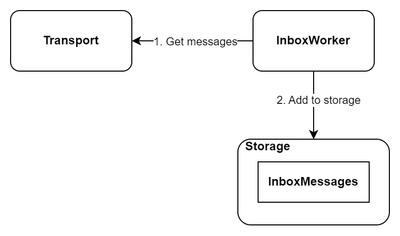
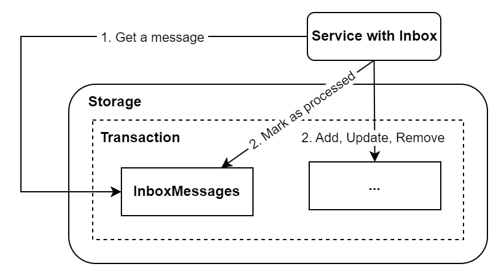

# Introduction

Transactional box is an implementation of the outbox and inbox pattern in .NET.
Ensures eventual consistency when modules need to communicate with each other over the network.

Examples of problems that occur during network communication:

- lost messages
- the same messages were processed again
- unavailable services

## :european_castle: Architecture
The transactional box consists of four basic components. The following diagrams show the basic flow (omits many details). They are designed to provide a general understanding of how transactional box works.

### Outbox
Outbox is responsible for adding messages to the storage.

### Outbox Worker
Outbox worker is responsible for getting the messages from storage and adding them to the transport.

### Inbox Worker
Inbox worker is responsible for getting messages from transport and adding them to the storage.

### Inbox 
Inbox is responsible for processing messages from the storage.

