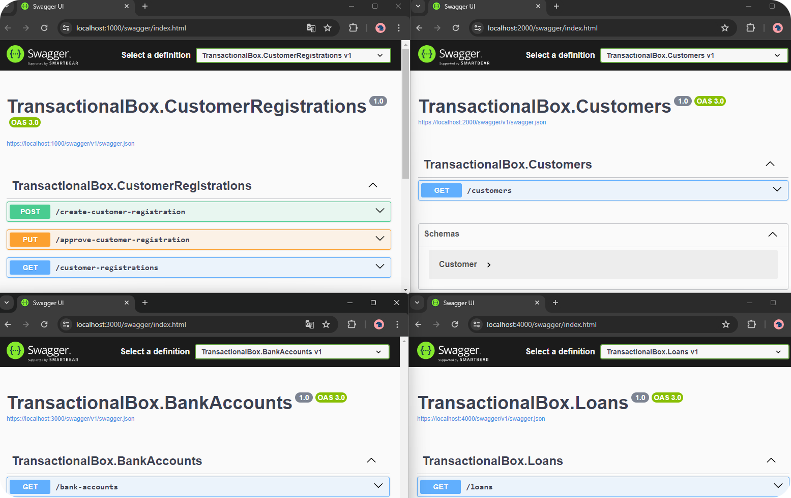

# Distributed Sample
Distributed sample consists of four modules with two instances each. Example shows a simplified banking domain
:::info
 Docker is required.
:::

Clone repo and open `TransactionalBox.sln` via Visual Studio. Set the `Bank` as startup and then run.   

Run browser and open below links:  
**CustomerRegistrations:** `https://localhost:1000/swagger/index.html`   
**Customers**: `https://localhost:2000/swagger/index.html`   
**BankAccounts:** `https://localhost:3000/swagger/index.html`   
**Loans:** `https://localhost:4000/swagger/index.html`

Don't forget to use break points to learn.   
Have fun :smiley:!