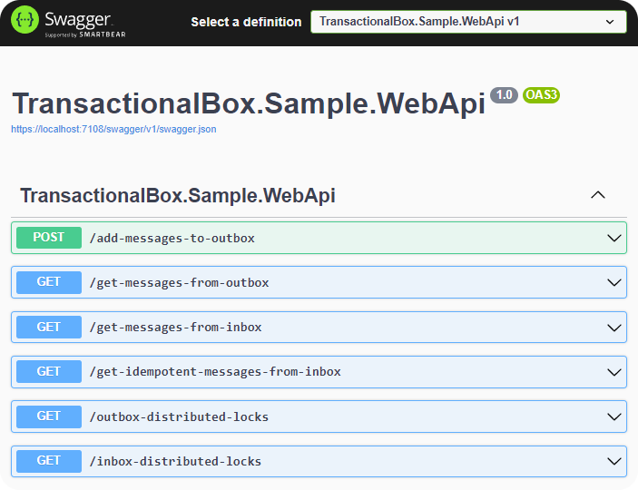

# Simple Sample
Simple sample consists of one module to help understand how transactional box works.

:::info
 Docker is required.
:::

Clone repo and open `TransactionalBox.sln` via Visual Studio. Set the `TransactionalBox.Sample.WebApi` as startup and then run. You should see the following view.

Don't forget to use break points to learn.   
Have fun :smiley:!